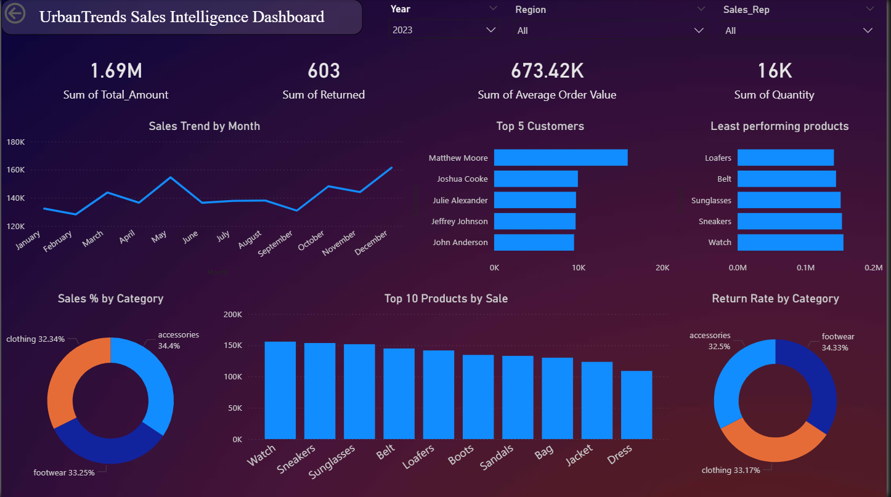
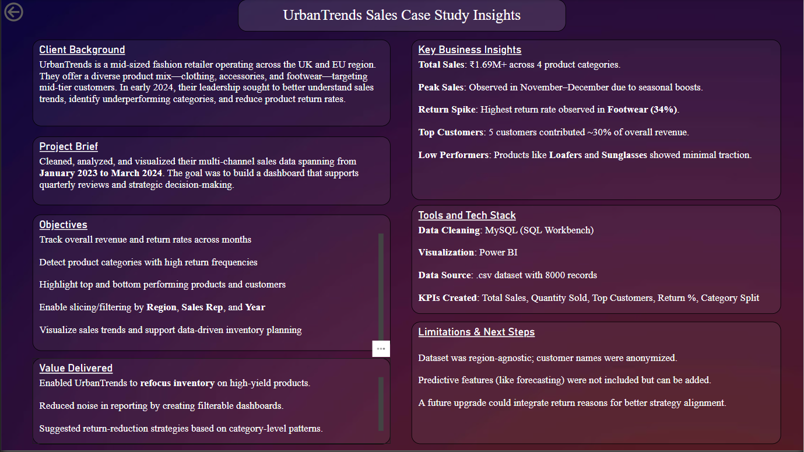

# 🛍️ UrbanTrends Sales Intelligence Dashboard

This project simulates a freelance-style data analysis engagement for a **UK-based retail fashion brand**. The primary goal was to derive **actionable sales insights** from transactional data using **MySQL for data preparation** and **Power BI for interactive dashboarding**.

---

## 📌 Business Context

In the competitive retail landscape, understanding **sales trends**, **return behavior**, and **customer performance** is critical for optimizing operations, inventory planning, and marketing strategies. This analysis was designed to **mirror real-world challenges faced by category managers and retail analysts**.

---

## 🎯 Problem Statement

> How can a retail fashion brand analyze its historical sales data to uncover trends, optimize inventory, and improve product performance?

---

## 💡 Project Objectives

- Analyze monthly sales and return trends across product categories  
- Identify **top customers** and **low-performing products**  
- Visualize regional sales patterns using interactive filters  
- Extract insights for strategic decisions in pricing, stocking, and promotions

---

## 📊 Dashboard Preview

---

## 🧰 Tools & Technologies

- **MySQL** – Data cleaning and transformation  
- **Power BI** – Data modeling, visual storytelling  
- **Excel** – Export/format tweaks for dashboard readiness  

---

## 📈 KPIs Tracked

- Total Revenue  
- Return Rate by Category  
- Top 5 Customers by Sales  
- Monthly Sales Trend  
- Category-wise Sales Distribution  
- Region-based Sales Performance  

---

## 🧠 Key Business Insights

- **November–December spike** due to holiday promotions  
- **Footwear** had the highest return rate (~34.3%) — potential inventory or quality issue  
- **Loafers and Sunglasses** were least performing by revenue  
- **Top 5 customers** contributed ~30% of total revenue — signals loyalty segment  
- **Region B** outperformed others — possible focus for upselling  

---

## 🧾 Retail Industry Relevance

This type of dashboard is directly applicable in:
- Fashion & Apparel Chains  
- E-commerce Retailers  
- Department Stores  
- Retail BI/Analytics Teams  

It serves as a key asset for:
- **Sales Operations**  
- **Category Managers**  
- **Inventory Planners**  
- **Customer Experience Analysts**

---

## 🔗 Deliverables

- `UrbanTrends_Sales.pbix` – Final Power BI dashboard  
- `/assets/` – Dashboard screenshots for LinkedIn & portfolio  
- *(Optional)* SQL scripts for backend cleaning – available on request

---

## ✅ Status

**Complete** – Actively used in portfolio and recruiter outreach to demonstrate domain understanding and dashboarding skills.

---

## ✍️ Author

**Abinash Sahoo**  
> “Believe it until you make it.”  
> Building from rock bottom to relentless 🚀

- GitHub: [abinashsahoo00](https://github.com/AbinashaSah00)  
- LinkedIn: [Abinash Sahoo](https://www.linkedin.com/in/abinashsahoo00)  
- Notion Portfolio: [Abinasha_Sahoo](https://www.notion.so/Hey-there-I-am-Abinash-Sahoo-1dfe544fcbea80ef973eec9fd705f513)

---
